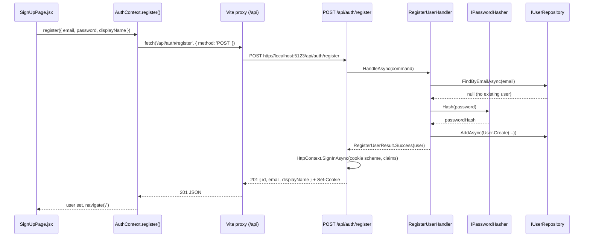

# Implementation Plan: 03 — Sign up for a new account

## Story

**As a** new visitor to the e-Pharmacy app,
**I want** to create an account with my email and a password,
**so that** I can place orders and manage them under my own account.

Acceptance criteria: see `docs/stories/03-sign-up-for-an-account.md`.

## Context

- Backend is Clean/DDD: Domain (no deps) → Application (ports/handlers) → Infrastructure (EF Core/SQLite) → Api (minimal APIs in `Program.cs`, DI wiring). Confirmed via the only existing feature slice: `HealthCheck` / `RecordHealthCheckHandler` / `IHealthCheckRepository` / `HealthCheckRepository` / `AppDbContext`.
- `AppDbContext` (`backend/src/EPharmacy.Infrastructure/AppDbContext.cs`) currently exposes only `DbSet<HealthCheck>`; migrations are applied automatically at API startup (`Program.cs`, `dbContext.Database.Migrate()`) — a documented dev-only convenience this story keeps using.
- No authentication, no `User` concept, and no password-hashing/cookie-auth packages exist anywhere in the solution (`EPharmacy.Api.csproj` only references `Microsoft.AspNetCore.OpenApi` and `EF Core.Design`; `EPharmacy.Infrastructure.csproj` only references `EF Core.Design`/`Sqlite`).
- `Program.cs` is a single flat file mapping one endpoint (`GET /health`) directly with `app.MapGet(...)`. This story adds several endpoints at once, which justifies introducing one small organizational convention now — a `MapXEndpoints(this WebApplication app)` extension method per feature area — instead of letting `Program.cs` keep growing linearly. This plan introduces `Endpoints/AuthEndpoints.cs` as the first instance; later stories are expected to follow the same shape (`Endpoints/CatalogEndpoints.cs`, etc.).
- Frontend has no router: `frontend/src/main.jsx` renders `<App />` directly, `react-router-dom` isn't in `package.json`, and `App.jsx` is a single view (header + `HealthBanner`). This is the first story needing more than one screen, so this plan lays the routing foundation the rest of the epic depends on.
- Per `.github/copilot-instructions.md`: backend tests are xUnit + FluentAssertions + Moq, Domain/Application built test-first (TDD), API tests use `WebApplicationFactory<Program>` (see `HealthEndpointTests.cs`). Frontend tests are Vitest + RTL, query by role/label/text.
- The Vite dev proxy (`frontend/vite.config.js`) currently forwards only `/health`. This story's endpoints live under a new `/api/...` namespace (see Approach), so the proxy needs a second rule.

## Approach

Two cross-cutting decisions are made here rather than deferred, because most of the remaining epic (stories 04, 05, 07–09, 11) needs "who is the current user" to already exist. First, **authentication mechanism**: ASP.NET Core cookie authentication (`AddAuthentication().AddCookie()`), not a full ASP.NET Core Identity setup and not JWTs. A same-origin SPA talking to its own backend through a dev proxy doesn't need a bearer token sitting in `localStorage` — an `httpOnly`, `SameSite=Lax` cookie keeps the session out of reach of XSS entirely, which a token-in-storage approach would not. Cookie-auth defaults redirect unauthenticated requests to an HTML login *page*, which is wrong for a JSON API, so `Events.OnRedirectToLogin`/`OnRedirectToAccessDenied` are overridden to return `401`/`403` instead. Second, **new endpoints live under `/api/...`** (`/api/auth/register`, and later `/api/catalog`, `/api/cart`, etc.), while the existing `/health` stays unprefixed — a deliberate namespace split between "operational" and "product" endpoints, not a reversal of the `/health` precedent.

Password hashing follows the same port/adapter shape as `IHealthCheckRepository`/`HealthCheckRepository`: `IPasswordHasher` is a small Application-layer port (`Hash`, `Verify`), implemented in Infrastructure by wrapping `Microsoft.Extensions.Identity.Core`'s `PasswordHasher<User>` — this reuses the same well-reviewed hashing algorithm ASP.NET Core Identity itself uses, without pulling in the full Identity framework (`UserManager`, EF Identity stores, roles) this project doesn't need. `RegisterUserHandler` returns a typed result (`RegisterUserResult`, a success/`EmailAlreadyRegistered` outcome) rather than throwing for the expected "email taken" case, keeping that path a normal control-flow branch the Api layer maps to `409 Conflict`.

On the frontend, `react-router-dom` is added as this story's first new npm dependency. `App.jsx` keeps its header/`HealthBanner` as persistent chrome (story 02 isn't undone) and gains a `<Routes>` block in `<main>` with a placeholder `/` route and the new `/signup` route. A small `AuthContext` (`src/context/AuthContext.jsx`) holds the current user in memory and exposes a `register()` call; it deliberately does **not** add a session-rehydration (`/api/auth/me`) endpoint in this story — the sign-up response already contains the user, and restoring an existing session after a page refresh isn't required by this story's acceptance criteria. That gap is called out in Open Questions so story 04 (login) picks it up deliberately rather than by accident.

## Architecture



```csharp
// backend/src/EPharmacy.Domain/User.cs (shape only)
public sealed class User
{
    public static User Create(Guid id, string email, string passwordHash, string displayName, DateTimeOffset createdAtUtc);
    public Guid Id { get; }
    public string Email { get; }
    public string PasswordHash { get; }
    public string DisplayName { get; }
    public DateTimeOffset CreatedAtUtc { get; }
}
```

```csharp
// backend/src/EPharmacy.Application/RegisterUserHandler.cs (shape only)
public sealed record RegisterUserCommand(string Email, string Password, string DisplayName);
public sealed record RegisterUserResult(bool Succeeded, bool EmailAlreadyRegistered, User? User);

public sealed class RegisterUserHandler
{
    public Task<RegisterUserResult> HandleAsync(RegisterUserCommand command, CancellationToken ct);
}
```

```
frontend/src/
├─ context/
│  └─ AuthContext.jsx        new — { user, register() }, no /me yet (see Open Questions)
├─ pages/
│  ├─ HomePage.jsx           new — placeholder '/' route (existing HealthBanner stays in App shell)
│  └─ SignUpPage.jsx         new — sign-up form, '/signup' route
├─ App.jsx                   modified — add <Routes> in <main>, keep header/HealthBanner
└─ main.jsx                  modified — wrap <App /> in <BrowserRouter>
```

## File Changes

- [x] `backend/src/EPharmacy.Domain/User.cs` — new entity with `Create` factory + guard clauses
- [x] `backend/tests/EPharmacy.Domain.Tests/UserTests.cs` — new, written first (TDD)
- [x] `backend/src/EPharmacy.Application/IUserRepository.cs` — new port
- [x] `backend/src/EPharmacy.Application/IPasswordHasher.cs` — new port
- [x] `backend/src/EPharmacy.Application/RegisterUserHandler.cs` — new handler + `RegisterUserCommand`/`RegisterUserResult`
- [x] `backend/tests/EPharmacy.Application.Tests/RegisterUserHandlerTests.cs` — new, written first (TDD), mocks both ports with Moq
- [x] `backend/src/EPharmacy.Infrastructure/UserRepository.cs` — new, implements `IUserRepository` against `AppDbContext`
- [x] `backend/src/EPharmacy.Infrastructure/PasswordHasher.cs` — new, wraps `PasswordHasher<User>` from `Microsoft.Extensions.Identity.Core`
- [x] `backend/src/EPharmacy.Infrastructure/EPharmacy.Infrastructure.csproj` — add `Microsoft.Extensions.Identity.Core` package reference
- [x] `backend/src/EPharmacy.Infrastructure/AppDbContext.cs` — add `DbSet<User> Users`, entity config (unique index on `Email`)
- [x] `backend/src/EPharmacy.Infrastructure/Migrations/*_AddUsers.cs` — new EF Core migration
- [x] `backend/src/EPharmacy.Api/Endpoints/AuthEndpoints.cs` — new, `MapAuthEndpoints(this WebApplication app)` with `POST /api/auth/register`
- [x] `backend/src/EPharmacy.Api/Program.cs` — register cookie authentication/authorization, DI for new ports/handler, call `app.MapAuthEndpoints()`
- [x] `backend/tests/EPharmacy.Api.Tests/AuthEndpointTests.cs` — new, `WebApplicationFactory`-based
- [x] `frontend/package.json` — add `react-router-dom` dependency
- [x] `frontend/vite.config.js` — add `/api` proxy rule alongside the existing `/health` one
- [x] `frontend/src/main.jsx` — wrap `<App />` in `<BrowserRouter>`
- [x] `frontend/src/context/AuthContext.jsx` — new context + `useAuth` hook (hook itself split into `useAuth.js`/`authContextInstance.js` — see Deviations)
- [x] `frontend/src/pages/HomePage.jsx` — new placeholder `/` route content
- [x] `frontend/src/pages/SignUpPage.jsx` — new sign-up form + `/signup` route
- [x] `frontend/src/pages/SignUpPage.test.jsx` — new component test
- [x] `frontend/src/App.jsx` — add `<Routes>` (`/`, `/signup`) inside `<main>`
- [x] `frontend/src/App.test.jsx` — update to route-aware rendering (wrap in `MemoryRouter`)

## Task Breakdown

1. [x] Write `UserTests.cs` (red): `User.Create` rejects empty email/password hash/display name and an empty Guid; happy path sets all properties. Implement `User.cs` to go green.
2. [x] Write `RegisterUserHandlerTests.cs` (red), mocking `IUserRepository` and `IPasswordHasher` with Moq: success path hashes the password, persists a new `User`, returns `Succeeded = true`; existing email short-circuits to `EmailAlreadyRegistered = true` without calling `AddAsync`. Implement `IUserRepository`, `IPasswordHasher`, `RegisterUserCommand`/`RegisterUserResult`, `RegisterUserHandler` to go green.
3. [x] Add `Microsoft.Extensions.Identity.Core` to `EPharmacy.Infrastructure.csproj`; implement `PasswordHasher` wrapping `PasswordHasher<User>`; implement `UserRepository` against `AppDbContext`.
4. [x] Add `DbSet<User> Users` + entity configuration to `AppDbContext` (unique index on `Email`); generate the `AddUsers` EF Core migration; confirm it applies cleanly to a fresh SQLite database.
5. [x] Register cookie authentication in `Program.cs` (`AddAuthentication().AddCookie(...)` with `OnRedirectToLogin`/`OnRedirectToAccessDenied` returning 401/403 instead of redirecting), `AddAuthorization()`, `UseAuthentication()`/`UseAuthorization()` in the pipeline, and DI registrations for the new port/handler.
6. [x] Create `Endpoints/AuthEndpoints.cs` with `MapAuthEndpoints`: `POST /api/auth/register` binds `{ email, password, displayName }`, validates non-empty fields and a basic email shape, calls `RegisterUserHandler`, signs the user in via `HttpContext.SignInAsync` with `NameIdentifier`/`Email` claims on success, and returns `201` / `409` (email taken) / `400` (validation).
7. [x] Write `AuthEndpointTests.cs`: register succeeds with `201` and a `Set-Cookie` header; registering the same email twice returns `409` the second time; missing/invalid fields return `400`.
8. [x] Add `react-router-dom` to `frontend/package.json`; wrap `<App />` in `<BrowserRouter>` in `main.jsx`.
9. [x] Add the `/api` proxy rule to `vite.config.js` alongside the existing `/health` rule.
10. [x] Create `AuthContext.jsx`/`useAuth`: `register(payload)` posts to `/api/auth/register`, sets `user` on success, surfaces the server's error message (duplicate email / validation) on failure.
11. [x] Restructure `App.jsx`: keep the header/`HealthBanner` shell, add `<Routes>` with `/` → `HomePage` (placeholder) and `/signup` → `SignUpPage`; update `App.test.jsx` to render within a `MemoryRouter`.
12. [x] Build `SignUpPage.jsx` (name, email, password fields; client-side required + basic email-shape validation; calls `useAuth().register`; shows the duplicate-email/validation error inline; on success calls `useNavigate()` to `/`); write `SignUpPage.test.jsx` covering validation-error, duplicate-email-error, and success-then-redirect paths with a mocked `fetch`.
13. [x] Full Definition of Done: `dotnet build`/`dotnet test` (whole solution), `npm run build`/`lint`/`test`; manual smoke test — start backend + frontend, sign up a new account in the browser, confirm redirect to `/` and a `Set-Cookie` in the network tab; `node scripts/validate-repository.mjs`.

## Commit Plan

| Tasks | Commit message | Hash |
|-------|-----------------|------|
| 1–2 | `feat(backend): add User domain entity and RegisterUserHandler (TDD)` | |
| 3–4 | `feat(backend): add EF Core persistence for users` | |
| 5–7 | `feat(backend): add cookie auth and POST /api/auth/register endpoint` | |
| 8–9 | `chore(frontend): add react-router-dom and /api dev proxy` | |
| 10–12 | `feat(frontend): add sign-up page and AuthContext` | |
| 13 | `docs(gen-e2): update story 03 and plan checkboxes` | |

## Acceptance Criteria Mapping

| AC | Task(s) |
|----|---------|
| Sign-up form collects name, email, password | 12 |
| Duplicate email rejected with a clear error | 2, 6, 7, 12 |
| Passwords hashed server-side, never stored/transmitted in plain text | 2, 3 |
| Successful sign-up authenticates and redirects into the app | 5, 6, 10, 12 |
| Client- and server-side validation on required fields/email format | 6, 12 |

## Testing Strategy

| Acceptance criterion | Observable seam | Cheapest proving layer | Approach | Cadence |
|---|---|---|---|---|
| `User.Create` invariants | Constructed entity / thrown exception | Domain unit | Test-first (TDD) | Every PR |
| Registration hashes password, rejects duplicate email | `RegisterUserHandler` result under mocked ports | Application unit | Test-first (TDD) | Every PR |
| `POST /api/auth/register` status codes and cookie | HTTP response via `WebApplicationFactory` | API functional | Test-alongside | Every PR |
| Sign-up form validation, error display, redirect | Rendered DOM under mocked `fetch` | Frontend component | Test-alongside | Every PR |
| End-to-end "type email/password, land on `/` authenticated" | Real browser + real backend | Manual smoke | Test-after | Pre-merge manual check only |

No E2E automation added yet — a single manual smoke check is enough for one linear flow; revisit once several auth-dependent journeys exist (post story 05) and a Playwright suite becomes worth the setup cost.

## Deviations

- `RegisterUserResult` was implemented as `public sealed record RegisterUserResult(bool Succeeded, User? User, string? Error)` with `Success(user)`/`Failure(error)` factories, instead of the plan's documented `(bool Succeeded, bool EmailAlreadyRegistered, User? User)`. Functionally equivalent (still a typed success/failure branch the Api layer maps to `409`), but carries a generic error message rather than a single dedicated boolean flag — chosen so the same shape can carry other future validation-failure reasons without adding more booleans.
- `frontend/src/context/AuthContext.jsx` ended up split across three files instead of one: `AuthContext.jsx` (the `AuthProvider` component), `authContextInstance.js` (the `createContext()` instance), and `useAuth.js` (the hook). This was required by the `react-refresh/only-export-components` ESLint rule, which fails a `.jsx` file that exports both a component and a non-component value/hook. Note for future stories: avoid naming the split-out file a same-name-different-case variant (e.g. `authContext.js` next to `AuthContext.jsx`) — on case-insensitive filesystems (macOS/Windows) this caused module resolution to pick the wrong file.

## Dependencies

None — first story in the epic; introduces the `User` entity, cookie auth, and frontend routing that stories 04, 05, 07–09, and 11 depend on.

## Open Questions

- Session isn't rehydrated after a page refresh (no `/api/auth/me` yet) — acceptable for this story's ACs, but story 04 (login) should decide whether to add it then, since "stay logged in across a refresh" is closer to a login/session concern than a sign-up one.
- Password strength rules and email verification are still unspecified (flagged in the story's own Notes) — this plan only enforces "non-empty" + basic email shape.
