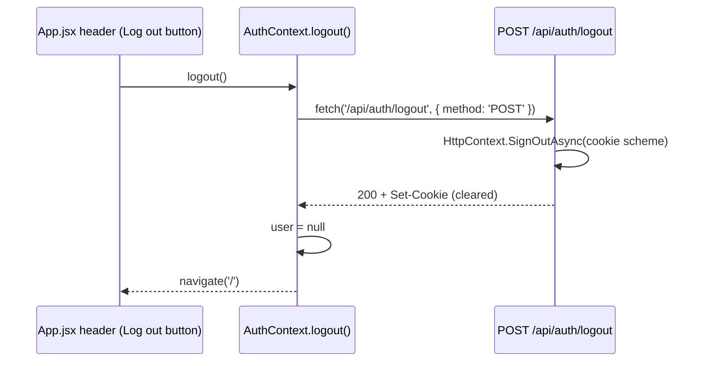

# Implementation Plan: 05 — Log out of the account

## Story

**As a** logged-in e-Pharmacy customer,
**I want** to log out of my account,
**so that** I can end my session, especially on a shared device.

Acceptance criteria: see `docs/stories/05-log-out-of-the-account.md`.

## Context

- Builds on plans 03/04: cookie authentication scheme, `AuthContext`, `RequireAuth`, and the protected `/account` page already exist.
- Signing out with cookie authentication is a single framework call — `HttpContext.SignOutAsync(CookieAuthenticationDefaults.AuthenticationScheme)` — which clears the auth cookie via a `Set-Cookie` response header; there's no server-side session store to clean up (no distributed cache/Redis introduced anywhere in this project).
- The only place a logout action can currently live is the `AccountPage` (the one protected page built in plan 04) and/or the persistent header in `App.jsx`. This plan puts it in the header since it's the natural, always-visible place — showing it there is also `App.jsx`'s existing job to render persistent chrome (it already renders the `HealthBanner` regardless of route).

## Approach

`POST /api/auth/logout` is added to `AuthEndpoints.cs`, calling `HttpContext.SignOutAsync` and returning `200`. It's a `POST` (not `GET`) specifically to avoid an OWASP-relevant mistake: a `GET` logout endpoint is trivially triggerable cross-site (e.g. via an `` on an unrelated page), which is a CSRF-style annoyance even for an action as low-stakes as logout.

`AuthContext` gains a `logout()` function that calls the endpoint and then clears `user` to `null` regardless of the response (a network failure shouldn't leave the UI claiming you're still logged in). The header in `App.jsx` conditionally renders a "Log out" button when `useAuth().user` is set; clicking it calls `logout()` and then `useNavigate()`s to `/`. Since `RequireAuth` already redirects to `/login` whenever `user` is `null`, logging out while sitting on the protected `/account` page naturally bounces the user away on the next render — no extra redirect logic needed there.

## Architecture

## File Changes

- [x] `backend/src/EPharmacy.Api/Endpoints/AuthEndpoints.cs` — add `POST /api/auth/logout`
- [x] `backend/tests/EPharmacy.Api.Tests/AuthEndpointTests.cs` — extend with logout case
- [x] `frontend/src/context/AuthContext.jsx` — add `logout()`
- [x] `frontend/src/App.jsx` — conditional "Log out" button in the header when `user` is set
- [x] `frontend/src/App.test.jsx` — extend with logged-in/logged-out header rendering cases

## Task Breakdown

1. [x] Add `POST /api/auth/logout` to `AuthEndpoints.cs` (`.RequireAuthorization()`), calling `HttpContext.SignOutAsync`.
2. [x] Extend `AuthEndpointTests.cs`: logging out after a successful login returns `200` with a cleared `Set-Cookie`, and a subsequent `GET /api/auth/me` returns `401`.
3. [x] Add `logout()` to `AuthContext.jsx`: calls the endpoint, then unconditionally sets `user` to `null` (`try`/`finally`).
4. [x] Add the "Log out" button to `App.jsx`'s header, rendered only when `user` is set; wires it to `logout()` followed by `useNavigate('/')`.
5. [x] Extend `App.test.jsx`: header shows "Log out" with a mocked authenticated `AuthContext` value and shows nothing (no button) when logged out.
6. [x] Manually verify: log in, visit `/account`, click "Log out" — confirm redirect to `/`, and that navigating back to `/account` now redirects to `/login`.
7. [x] Full Definition of Done: `dotnet build`/`dotnet test`, `npm run build`/`lint`/`test`, manual smoke test, `node scripts/validate-repository.mjs`.

## Commit Plan

| Tasks | Commit message | Hash |
|-------|-----------------|------|
| 1–2 | `feat(backend): add POST /api/auth/logout` | |
| 3–5 | `feat(frontend): add logout action to header` | |
| 6–7 | `docs(gen-e2): update story 05 and plan checkboxes` | |

## Acceptance Criteria Mapping

| AC | Task(s) |
|----|---------|
| Visible logout action for logged-in users | 4, 5 |
| Session/cookie cleared on logout | 1, 2, 3 |
| Redirect after logout | 4, 6 |

## Testing Strategy

| Acceptance criterion | Observable seam | Cheapest proving layer | Approach | Cadence |
|---|---|---|---|---|
| Logout clears the server-side cookie session | HTTP response + follow-up `/api/auth/me` via `WebApplicationFactory` | API functional | Test-alongside | Every PR |
| Header shows/hides the logout action based on auth state | Rendered DOM under mocked `AuthContext` | Frontend component | Test-alongside | Every PR |
| Full logged-in → logout → protected-page-redirects journey | Real browser + real backend | Manual smoke | Test-after | Pre-merge manual check only |

## Deviations

- `App.jsx`'s header could not call `useAuth()` directly because `App` itself renders `<AuthProvider>` as the root of its return value, so `App`'s own function body sits outside the provider's subtree. The header was extracted into a small `AppHeader` child component rendered inside `<AuthProvider>`, which calls `useAuth()` and `useNavigate()`.
- Task 6's manual check anticipated landing on `/` after clicking "Log out" from `/account`. In practice the app lands on `/login` instead: clearing `user` re-renders `RequireAuth` on the still-mounted `/account` route, which redirects to `/login` before (or racing with) the header's own `navigate('/')` call. This still satisfies AC3 ("protected pages redirect to login after logout") and arguably better serves AC2/AC3 together, so it was kept as-is rather than forcing a `/` landing.

## Dependencies

Depends on story 04 (cookie auth session, `AuthContext`, `RequireAuth`, `/account`).

## Open Questions

None.
