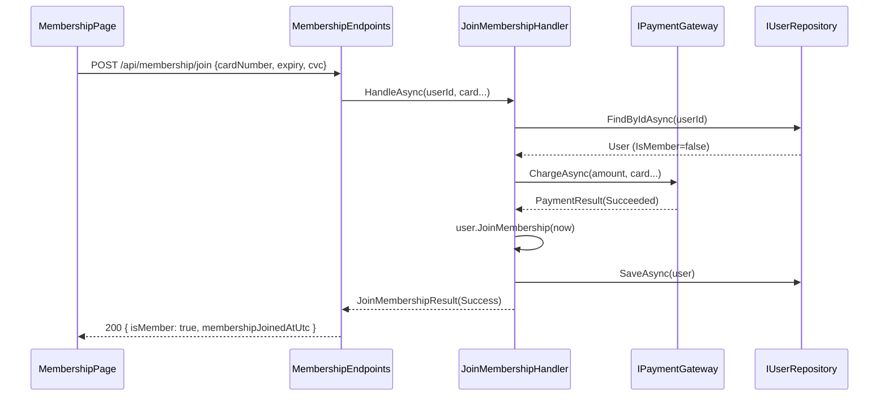

# Implementation Plan: 12 — View and join a membership tier

## Story

See [docs/stories/12-membership-program.md](../stories/12-membership-program.md).

## Context

The app already has an established one-aggregate-per-slice pattern (Domain entity + factory →
Application port interface → Infrastructure repository → Application handler → Api endpoint
extension method, wired in `Program.cs`), used consistently for `Medicine`/reviews, `Cart`, and
`Order`. Auth is cookie-based; `User` is currently an immutable-ish aggregate (get-only
properties set once in `Create`). `PlaceOrderHandler` computes `totalCents` from cart line items
and charges it via `IPaymentGateway` (`FakePaymentGateway`, which declines only the fixed test
card `4000000000000002`). `/api/auth/me`, `/api/auth/register`, and `/api/auth/login` all return
a `{ id, email, displayName }` shape built from claims/`User`.

Membership is a 1:1 relationship with a user (no independent lifecycle beyond "joined or not"),
so this plan extends the existing `User` aggregate rather than introducing a new one — consistent
with keeping the model as simple as the single-tier scope requires (see Notes in the story for the
scoping decisions: single "e-Pharmacy Plus" tier, 10% discount on order totals, paid enrollment via
the existing fake payment gateway).

## Approach

- **Domain**: add `IsMember` (bool) and `MembershipJoinedAtUtc` (`DateTimeOffset?`) to `User`, plus
  a `JoinMembership(DateTimeOffset joinedAtUtc)` method that throws if already a member. This
  mirrors the existing mutable-method style already used on `Cart` (e.g. `AddItem`, `Clear`).
- **Application**: add `IUserRepository.SaveAsync(User, CancellationToken)` (mirrors
  `ICartRepository.SaveAsync`). Add `JoinMembershipHandler` (finds the user, declines if already a
  member, charges via `IPaymentGateway`, calls `user.JoinMembership(...)`, saves). Modify
  `PlaceOrderHandler` to look up the user via `IUserRepository` and apply a 10% discount
  (`totalCents -= totalCents / 10`, i.e. round down in cents) to the amount charged and stored on
  the order when `user.IsMember` is true.
- **Infrastructure**: EF Core config for the two new `User` properties in `AppDbContext`, a new
  migration, and `UserRepository.SaveAsync` (update pattern identical to `CartRepository.SaveAsync`).
- **Api**: extend the anonymous response objects in `AuthEndpoints` (`/me`, register, login) to
  include `isMember`/`membershipJoinedAtUtc` so the frontend `user` object already has this data
  with no extra fetch. New `MembershipEndpoints.cs` with `POST /api/membership/join` (authenticated,
  reuses the `CheckoutRequest`-style card fields, returns 409 if already a member, mirrors
  checkout's payment-declined handling).
- **Frontend**: new `MembershipPage.jsx` at `/membership`, linked from the header nav for everyone.
  Logged out → benefit copy + "Log in to join" CTA. Logged in, not a member → benefit copy + a
  join form (same 4 fields as checkout: card number/expiry/cvc, no shipping address). Logged in,
  member → "You're an e-Pharmacy Plus member since {date}" status, no form. On successful join,
  update the shared `user` object (via `AuthContext`) so the discount and status reflect
  immediately everywhere (header, checkout).
- No new domain aggregate/table was introduced (rejected alternative) because a dedicated
  `Membership` entity would add a join/repository/migration for a relationship that is currently
  always 1:1 and has no fields beyond "joined or not" — extending `User` is simpler and matches the
  actual scope.



```csharp
// backend/src/EPharmacy.Domain/User.cs (shape only, additive)
public sealed class User
{
    public bool IsMember { get; private set; }
    public DateTimeOffset? MembershipJoinedAtUtc { get; private set; }

    public void JoinMembership(DateTimeOffset joinedAtUtc)
    {
        if (IsMember) throw new InvalidOperationException("User is already a member.");
        IsMember = true;
        MembershipJoinedAtUtc = joinedAtUtc;
    }
}
```

```csharp
// backend/src/EPharmacy.Application/JoinMembershipHandler.cs (shape only)
public enum JoinMembershipStatus { Success, AlreadyMember, PaymentDeclined }
public sealed record JoinMembershipResult(JoinMembershipStatus Status, DateTimeOffset? JoinedAtUtc, string? FailureReason);

public sealed class JoinMembershipHandler
{
    public const int MembershipFeeCents = 499; // $4.99, simulated one-time charge

    public Task<JoinMembershipResult> HandleAsync(Guid userId, string cardNumber, string expiry, string cvc, CancellationToken ct);
}
```

## File Changes

- [ ] `backend/src/EPharmacy.Domain/User.cs` — add `IsMember`, `MembershipJoinedAtUtc`, `JoinMembership(...)`
- [ ] `backend/tests/EPharmacy.Domain.Tests/UserTests.cs` — tests for `JoinMembership` (sets fields, throws if already a member)
- [ ] `backend/src/EPharmacy.Application/IUserRepository.cs` — add `SaveAsync`
- [ ] `backend/src/EPharmacy.Application/JoinMembershipHandler.cs` — new
- [ ] `backend/tests/EPharmacy.Application.Tests/JoinMembershipHandlerTests.cs` — new (success, already-member, payment-declined)
- [ ] `backend/src/EPharmacy.Application/PlaceOrderHandler.cs` — inject `IUserRepository`, apply 10% discount for members
- [ ] `backend/tests/EPharmacy.Application.Tests/PlaceOrderHandlerTests.cs` — update constructor calls; add a member-discount test
- [ ] `backend/src/EPharmacy.Infrastructure/UserRepository.cs` — implement `SaveAsync`
- [ ] `backend/src/EPharmacy.Infrastructure/AppDbContext.cs` — EF config for the two new `User` properties
- [ ] `backend/src/EPharmacy.Infrastructure/Migrations/*` — new migration `AddMembershipToUser`
- [ ] `backend/src/EPharmacy.Api/Endpoints/AuthEndpoints.cs` — include `isMember`/`membershipJoinedAtUtc` in `/me`, register, login responses
- [ ] `backend/src/EPharmacy.Api/Endpoints/MembershipEndpoints.cs` — new, `POST /api/membership/join`
- [ ] `backend/src/EPharmacy.Api/Program.cs` — DI registrations + `app.MapMembershipEndpoints()`
- [ ] `frontend/src/pages/MembershipPage.jsx` — new
- [ ] `frontend/src/pages/MembershipPage.test.jsx` — new
- [ ] `frontend/src/App.jsx` — add `/membership` route + header nav link
- [ ] `frontend/src/App.test.jsx` (if present) — update for new nav link if it asserts header contents

## Task Breakdown

1. [ ] Domain: `User.JoinMembership` + tests
2. [ ] Application: `IUserRepository.SaveAsync` + `JoinMembershipHandler` + tests
3. [ ] Application: member discount in `PlaceOrderHandler` + tests
4. [ ] Infrastructure: EF config, migration, `UserRepository.SaveAsync`
5. [ ] Api: `MembershipEndpoints`, `/me` response fields, `Program.cs` wiring
6. [ ] Frontend: `MembershipPage`, route, nav link, `AuthContext` refresh-on-join
7. [ ] Verify: backend `dotnet test`, frontend `npm run test`/`build`/lint; commit

## Commit Plan

| Tasks | Commit message | Hash |
|---|---|---|
| 1-2 | `feat(membership): add User.JoinMembership and JoinMembershipHandler` | |
| 3 | `feat(membership): apply 10% member discount in checkout` | |
| 4-5 | `feat(membership): add membership join API and migration` | |
| 6 | `feat(membership): add membership page and nav link` | |

## Acceptance Criteria Mapping

| Acceptance Criterion | Implementation |
|---|---|
| Membership page explains the tier/benefit, visible to all | `MembershipPage.jsx`, unauthenticated-friendly route |
| Not-yet-member sees a join form, becomes a member on success | `MembershipEndpoints.MapMembershipEndpoints` `POST /join` + `JoinMembershipHandler` + `MembershipPage.jsx` form |
| Member sees status (member since date) | `/api/auth/me` returns `membershipJoinedAtUtc`; `MembershipPage.jsx` renders it |
| Checkout totals reflect 10% discount for members | `PlaceOrderHandler` discount logic |

## Testing Strategy

- Domain: `UserTests` — `JoinMembership` sets fields; throws `InvalidOperationException` if already a member.
- Application: `JoinMembershipHandlerTests` — success path charges and saves; already-member short-circuits without charging; payment decline does not mark the user a member. `PlaceOrderHandlerTests` — non-member pays full price; member pays 90% (verify charged amount and stored `TotalCents`).
- Frontend: `MembershipPage.test.jsx` — renders benefit copy for logged-out users; renders join form for a logged-in non-member and calls `/api/membership/join` on submit; renders "member since" status for a member.
- Manual: sign up → join membership → place an order → confirm order total is 10% lower than the pre-membership catalog price.

## Dependencies

- Depends on existing auth (story for sign-up/login), cart/checkout (`PlaceOrderHandler`), and the `FakePaymentGateway` convention.

## Open Questions

None outstanding — scope was clarified with the user before this plan was written (see story Notes).
